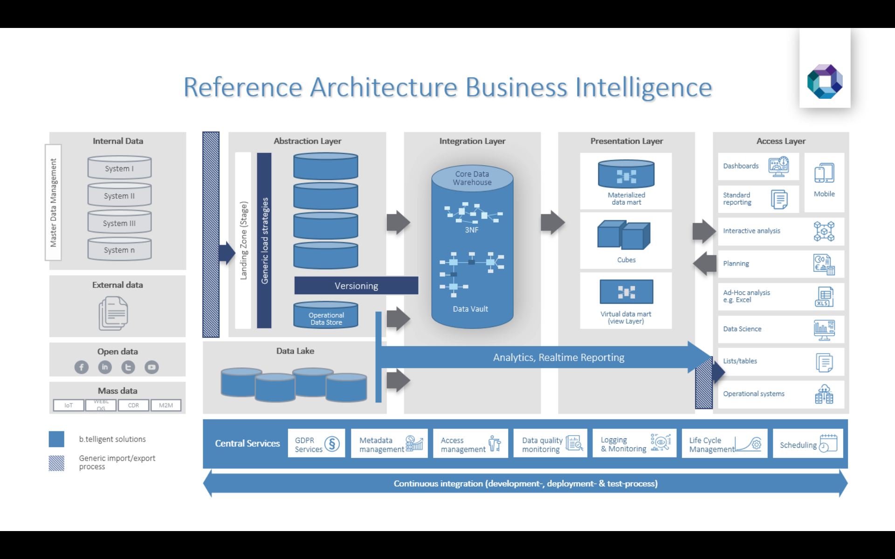
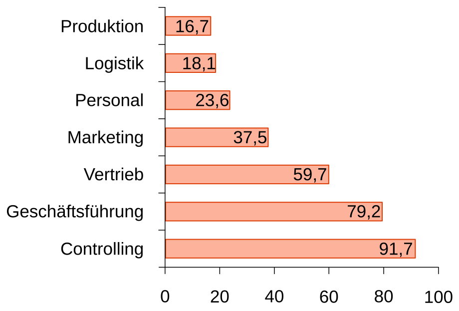

# BIS 242: Business Intelligence
## Lecture for Hannover University of Applied Sciences and Arts
This repository contains the lecture notes for BIS-242 at Hannover University of Applied Sciences and Arts. It makes use of the HTML presentation framework [revealjs](revealjs.com).

## How to make the slides available to the students
There is a github action activated, which will automatically upload all pushes to the main branch to [bis-242.doerffler.com](http://bis-242.doerffler.com). We provide a link to each of the slide decks using [moodle](https://moodle.hs-hannover.de). We also upload a pdf of each slide deck to moodle.

## Best Practices / Style Guidelines
### Mark things in images
You can combine the class "r-data-stack" and svg syntax to mark things on an image:

    

		  
			<svg height="480" width="850">
			  <ellipse cx="720" cy="195" rx="70" ry="20" fill-opacity="0.0" style="stroke:var(--hsh_orange);stroke-width:2" />
				</svg>
    

### Quotation guidelines
Use `figure` and `figcaption` to quote an image:

    <figure>
		
		<figcaption>
          Gluchowski, P., Gabriel, R., & Dittmar, C. (2008). Management Support Systeme und Business
				  Intelligence: Computergestützte Informationssysteme für Fach- und Führungskräfte. Berlin:
				  Springer
	  </figcaption>
	</figure>

### Using mermaid to create diagrams
You can use [mermaid](https://mermaid.js.org/) To create simple diagrams. There are some problems embedding the java script library directly to the project though. This can be fixed by exporting the mermaid drawings as svg and just embed that to the slides. We used the following mermaid settings, for styling the diagrams:

    theme: 'neutral',
    themeVariables: {
      "nodeBorder": "#dc3c05",
      "mainBkg": "#dc3b055d",
      "nodeTextColor": "#000000",
      "fontSize": "18px"
    }

### Adding QR-Codes to the slides